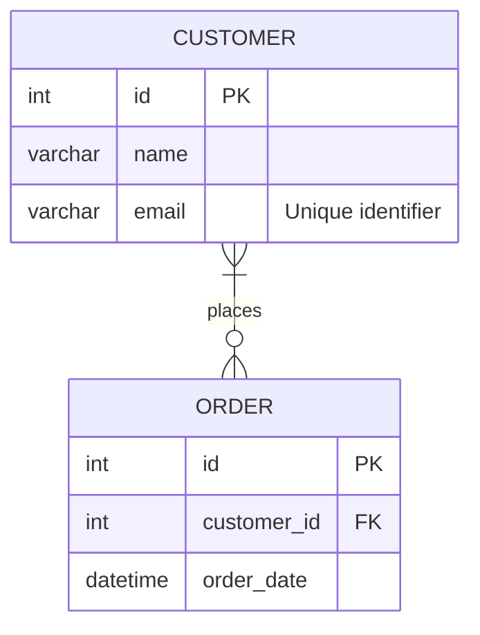

# Mermaid ER Diagram Rendering

This document explains how to generate Mermaid syntax for Entity Relationship Diagrams (ERD) using the `diagrams` gem combined with the `mermaid-ruby` renderer extensions.

## Basic Usage

First, ensure you have both `diagrams` and `mermaid-ruby` gems included in your project.

```ruby
require 'diagrams' # Require the base gem
require 'mermaid'  # Require this gem to prepend renderers
```

Create an instance of `Diagrams::ERDiagram` and add entities and relationships using its methods.

```ruby
# Create the diagram object
diagram = Diagrams::ERDiagram.new

# Add entities
diagram.add_entity(
  name: 'CUSTOMER',
  attributes: [
    { type: 'int', name: 'id', keys: [:PK] },
    { type: 'varchar', name: 'name' },
    { type: 'varchar', name: 'email', comment: 'Unique identifier' }
  ]
)
diagram.add_entity(
  name: 'ORDER',
  attributes: [
    { type: 'int', name: 'id', keys: [:PK] },
    { type: 'int', name: 'customer_id', keys: [:FK] },
    { type: 'datetime', name: 'order_date' }
  ]
)

# Add a relationship
# Cardinality symbols: :ZERO_OR_ONE, :ONE_ONLY, :ZERO_OR_MORE, :ONE_OR_MORE
# Identifying: true (solid line) or false (dashed line)
diagram.add_relationship(
  entity1: 'CUSTOMER',
  entity2: 'ORDER',
  cardinality1: :ONE_OR_MORE,
  cardinality2: :ZERO_OR_MORE,
  identifying: true, # Identifying relationship
  label: 'places'
)

# Generate Mermaid syntax
puts diagram.to_mermaid
```

## Generated Mermaid Output

The code above will generate the following Mermaid syntax:



## Complex Example (Fantasy ERD)

This example demonstrates various relationship types.

```ruby
# Code from test_complex_fantasy_erd in test/mermaid/er_diagram_test.rb
diagram = Diagrams::ERDiagram.new

# ... (Entity definitions as in the test) ...
diagram.add_entity(name: 'WIZARD', attributes: [{ type: 'int', name: 'wizard_id', keys: [:PK] }, { type: 'string', name: 'name' }, { type: 'int', name: 'power_level' }])
diagram.add_entity(name: 'FAMILIAR', attributes: [{ type: 'int', name: 'familiar_id', keys: [:PK] }, { type: 'int', name: 'wizard_id', keys: [:FK] }, { type: 'string', name: 'species' }, { type: 'string', name: 'name' }])
# ... (add all other entities) ...
diagram.add_entity(name: 'CLASS', attributes: [{ type: 'int', name: 'class_id', keys: [:PK] }, { type: 'string', name: 'name' }, { type: 'string', name: 'primary_stat' }])


# ... (Relationship definitions as in the test) ...
diagram.add_relationship(entity1: 'WIZARD', entity2: 'FAMILIAR', cardinality1: :ONE_ONLY, cardinality2: :ONE_ONLY, identifying: false, label: 'has exactly one')
diagram.add_relationship(entity1: 'SPELLBOOK', entity2: 'SPELL', cardinality1: :ONE_ONLY, cardinality2: :ZERO_OR_MORE, identifying: false, label: 'contains many')
# ... (add all other relationships) ...
diagram.add_relationship(entity1: 'RACE', entity2: 'CLASS', cardinality1: :ONE_OR_MORE, cardinality2: :ONE_OR_MORE, identifying: true, label: 'can choose')

puts diagram.to_mermaid
```

### Generated Output (Complex Example)

```mermaid
erDiagram
    "WIZARD" {
        int wizard_id PK
        string name
        int power_level
    }
    "FAMILIAR" {
        int familiar_id PK
        int wizard_id FK
        string species
        string name
    }
    "SPELLBOOK" {
        int book_id PK
        string title
        int wizard_id FK
    }
    "SPELL" {
        int spell_id PK
        int book_id FK
        string name
        string effect
    }
    "POTION" {
        int potion_id PK
        int alchemist_id FK
        string effect
        int potency
    }
    "ALCHEMIST" {
        int alchemist_id PK
        string name
        int skill_level
    }
    "ADVENTURER" {
        int adventurer_id PK
        string name
        string class
    }
    "QUEST" {
        int quest_id PK
        string title
        string description
    }
    "ARTIFACT" {
        int artifact_id PK
        int guardian_id FK
        string name
        string power
    }
    "GUARDIAN" {
        int guardian_id PK
        string type
        int strength
    }
    "DRAGON" {
        int dragon_id PK
        string name
        string color
    }
    "TREASURE" {
        int treasure_id PK
        int dragon_id FK
        string type
        int value
    }
    "GUILD" {
        int guild_id PK
        string name
        string location
    }
    "MEMBER" {
        int member_id PK
        int guild_id FK
        string name
        string rank
    }
    "KINGDOM" {
        int kingdom_id PK
        string name
        string ruler
    }
    "PROVINCE" {
        int province_id PK
        int kingdom_id FK
        string name
        string governor
    }
    "ENCHANTMENT" {
        int enchantment_id PK
        string type
        int power
    }
    "ITEM" {
        int item_id PK
        int enchantment_id FK
        string name
        string rarity
    }
    "MENTOR" {
        int mentor_id PK
        string name
        int wisdom
    }
    "APPRENTICE" {
        int apprentice_id PK
        int mentor_id FK
        string name
        int potential
    }
    "FACTION" {
        int faction_id PK
        string name
        string alignment
    }
    "FACTION_MEMBER" {
        int member_id PK
        int faction_id FK
        string name
        string role
    }
    "RACE" {
        int race_id PK
        string name
        int lifespan
    }
    "CLASS" {
        int class_id PK
        string name
        string primary_stat
    }
    "WIZARD" ||--|| "FAMILIAR" : "has exactly one"
    "SPELLBOOK" ||--o{ "SPELL" : "contains many"
    "POTION" }o--|| "ALCHEMIST" : "created by one"
    "ADVENTURER" }o--o{ "QUEST" : "undertakes many"
    "ARTIFACT" |o--|| "GUARDIAN" : "protected by one"
    "DRAGON" |o--o{ "TREASURE" : "hoards many"
    "GUILD" ||--o{ "MEMBER" : "may have members"
    "KINGDOM" ||--|{ "PROVINCE" : "rules at least one"
    "ENCHANTMENT" |o--o{ "ITEM" : "may enhance"
    "MENTOR" |o--|{ "APPRENTICE" : "trains at least one"
    "FACTION" ||--o{ "FACTION_MEMBER" : "has"
    "RACE" }|--|{ "CLASS" : "can choose"