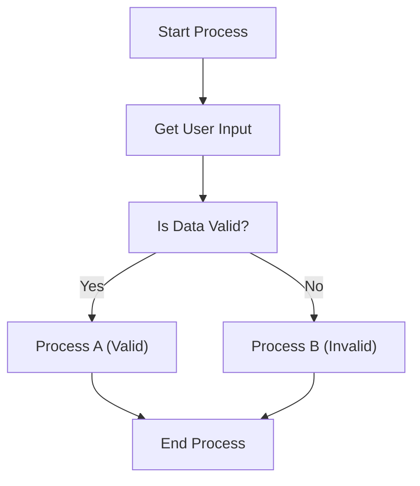

# Flowchart Diagram Mermaid Output

This document shows an example of creating a `Diagrams::FlowchartDiagram` object and the resulting Mermaid syntax generated by the `#to_mermaid` method (added by the `mermaid-ruby` gem).

## Example Ruby Code

```ruby
require 'diagrams'
require 'mermaid' # Applies the #to_mermaid patch

# Define nodes
start_node = Diagrams::Elements::Node.new(id: 'start', label: 'Start Process')
input_node = Diagrams::Elements::Node.new(id: 'input', label: 'Get User Input')
# Node shapes are not directly supported by diagram gem's Node,
# Mermaid output uses default rectangle shape: id["label"]
decision_node = Diagrams::Elements::Node.new(id: 'decide', label: 'Is Data Valid?')
process_a = Diagrams::Elements::Node.new(id: 'proc_a', label: 'Process A (Valid)')
process_b = Diagrams::Elements::Node.new(id: 'proc_b', label: 'Process B (Invalid)')
end_node = Diagrams::Elements::Node.new(id: 'end_node', label: 'End Process')  # Changed ID to end_node

# Define edges
edge1 = Diagrams::Elements::Edge.new(source_id: 'start', target_id: 'input')
edge2 = Diagrams::Elements::Edge.new(source_id: 'input', target_id: 'decide')
edge3 = Diagrams::Elements::Edge.new(source_id: 'decide', target_id: 'proc_a', label: 'Yes')
edge4 = Diagrams::Elements::Edge.new(source_id: 'decide', target_id: 'proc_b', label: 'No')
edge5 = Diagrams::Elements::Edge.new(source_id: 'proc_a', target_id: 'end_node')  # Updated target_id
edge6 = Diagrams::Elements::Edge.new(source_id: 'proc_b', target_id: 'end_node')  # Updated target_id

# Create diagram
diagram = Diagrams::FlowchartDiagram.new(
  nodes: [start_node, input_node, decision_node, process_a, process_b, end_node],
  edges: [edge1, edge2, edge3, edge4, edge5, edge6]
)

# Generate Mermaid syntax
mermaid_output = diagram.to_mermaid

puts mermaid_output
```

## Generated Mermaid Syntax


