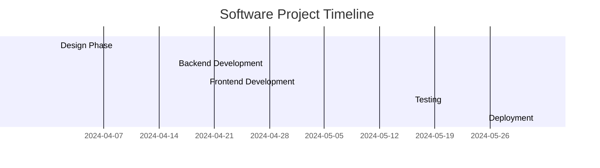

# Gantt Diagram Mermaid Output

This document shows an example of creating a `Diagrams::GanttDiagram` object and the resulting Mermaid syntax generated by the `#to_mermaid` method (added by the `mermaid-ruby` gem).

## Example Ruby Code

```ruby
require 'diagrams'
require 'mermaid' # Applies the #to_mermaid patch

# Define tasks
# Note: diagram gem currently only supports start/end dates, not durations or sections.
task_design = Diagrams::Elements::Task.new(
  id: 'design',
  name: 'Design Phase',
  start_date: '2024-04-01',
  end_date: '2024-04-15'
)
task_dev_be = Diagrams::Elements::Task.new(
  id: 'dev_be',
  name: 'Backend Development',
  start_date: '2024-04-16',
  end_date: '2024-05-10'
)
task_dev_fe = Diagrams::Elements::Task.new(
  id: 'dev_fe',
  name: 'Frontend Development',
  start_date: '2024-04-20', # Starts slightly after backend
  end_date: '2024-05-15'
)
task_test = Diagrams::Elements::Task.new(
  id: 'test',
  name: 'Testing',
  start_date: '2024-05-16',
  end_date: '2024-05-30'
)
task_deploy = Diagrams::Elements::Task.new(
  id: 'deploy',
  name: 'Deployment',
  start_date: '2024-06-01',
  end_date: '2024-06-05'
)

# Create diagram
diagram = Diagrams::GanttDiagram.new(
  title: 'Software Project Timeline',
  tasks: [task_design, task_dev_be, task_dev_fe, task_test, task_deploy]
)

# Generate Mermaid syntax
mermaid_output = diagram.to_mermaid

puts mermaid_output
```

## Generated Mermaid Syntax

