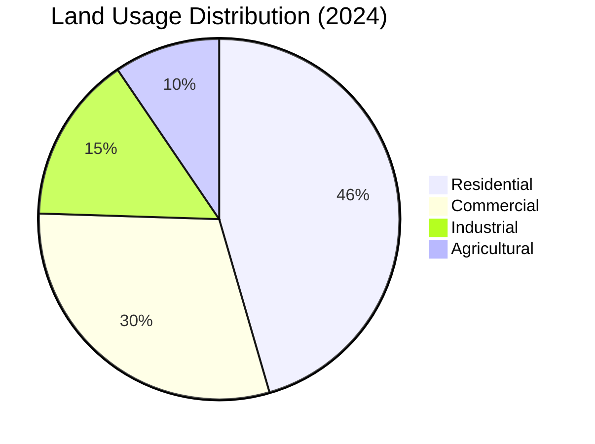

# Pie Diagram Mermaid Output

This document shows an example of creating a `Diagrams::PieDiagram` object and the resulting Mermaid syntax generated by the `#to_mermaid` method (added by the `mermaid-ruby` gem).

## Example Ruby Code

```ruby
require 'diagrams'
require 'mermaid' # Applies the #to_mermaid patch

# Define slices
slice1 = Diagrams::Elements::Slice.new(label: 'Residential', value: 45.5)
slice2 = Diagrams::Elements::Slice.new(label: 'Commercial', value: 30)
slice3 = Diagrams::Elements::Slice.new(label: 'Industrial', value: 15)
slice4 = Diagrams::Elements::Slice.new(label: 'Agricultural', value: 9.5)

# Create diagram
diagram = Diagrams::PieDiagram.new(
  title: 'Land Usage Distribution (2024)',
  slices: [slice1, slice2, slice3, slice4]
)

# Generate Mermaid syntax
mermaid_output = diagram.to_mermaid

puts mermaid_output
```

## Generated Mermaid Syntax

